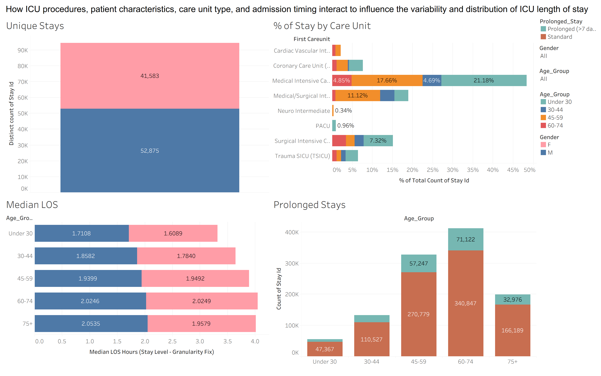
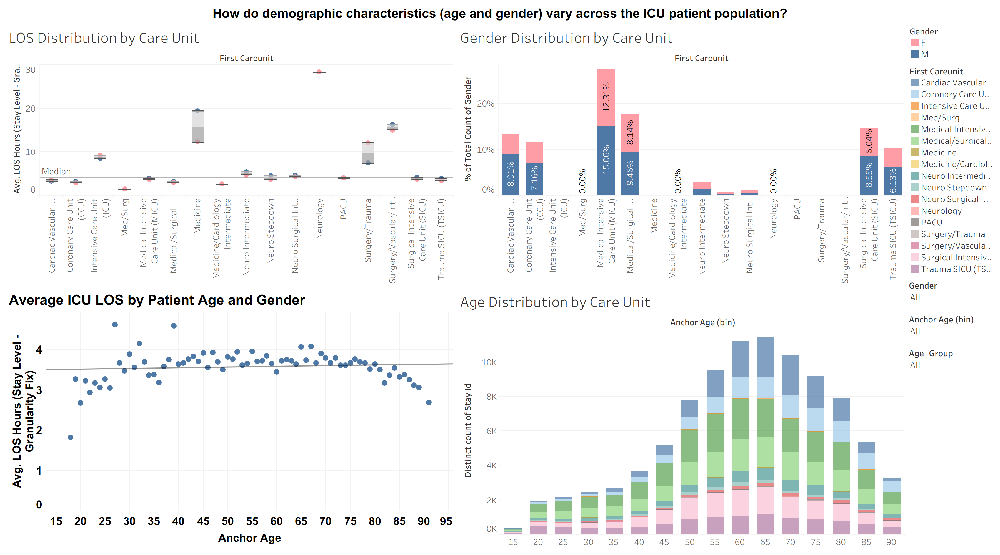
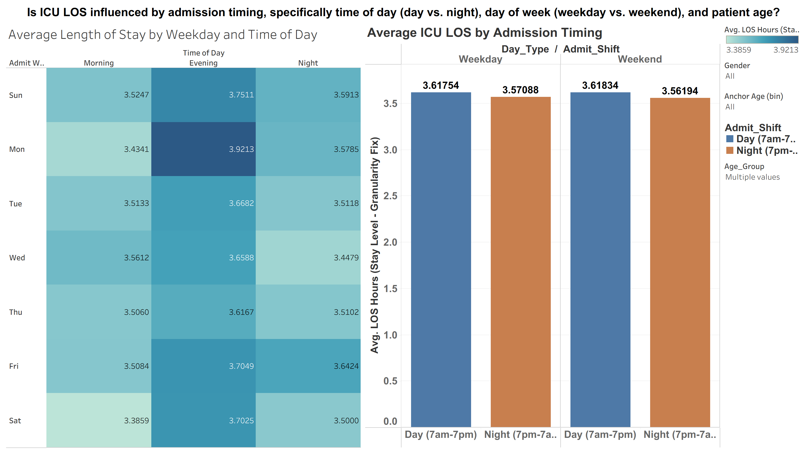
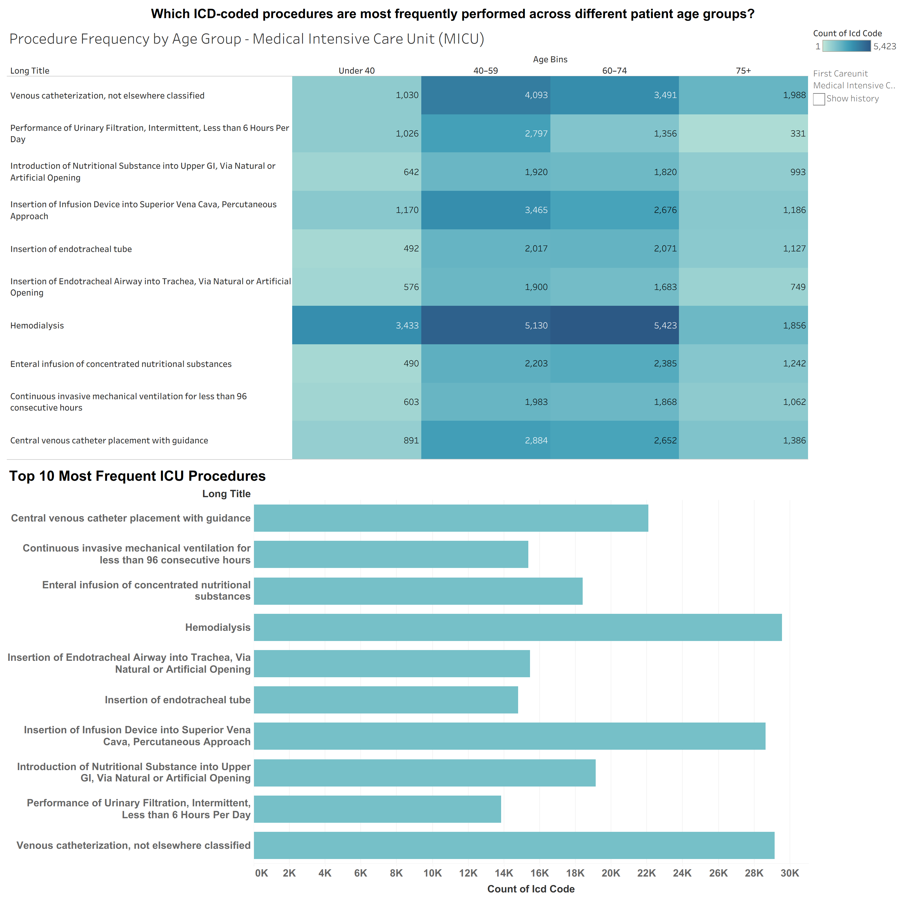
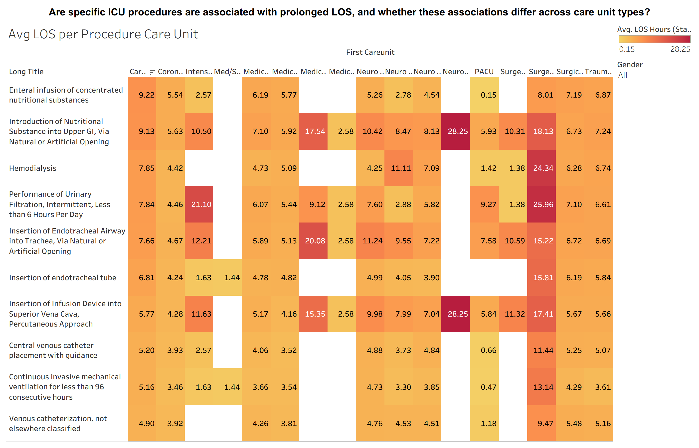
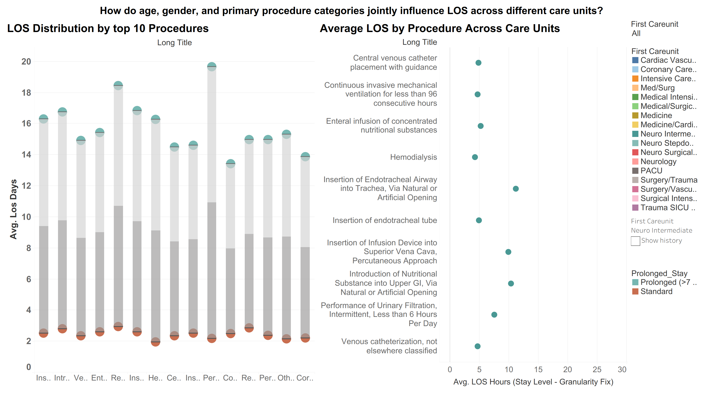

# ICU Length of Stay Dashboard

This dashboard visualizes how patient characteristics, care unit type, and admission patterns influence the distribution and variability of ICU length of stay. It integrates multiple perspectives — counts, proportions, medians, and stratified comparisons — to highlight where prolonged stays occur and which populations or units drive the most ICU utilization.

---

## Dashboard 1 — KPIs: ICU Stay Overview

> How do ICU procedures, patient characteristics, care unit type, and admission timing interact to influence the variability and distribution of ICU length of stay?

| KPI | Summary | Key Observation |
|---|---|---|
| **Unique ICU Stays** | Total ICU volume split by standard vs. prolonged stays | Prolonged stays make up a smaller share but represent a significant portion of overall ICU utilization |
| **% of Stays by Care Unit** | Distribution of stays across units, including prolonged-stay burden | Medical and Surgical ICUs account for the largest share and also show higher proportions of prolonged stays |
| **Median LOS by Age & Gender** | Median ICU LOS across age groups, split by gender | Median LOS rises steadily across age groups — older patients generally require longer ICU care |
| **Prolonged Stays by Age Group** | Volume of prolonged stays by age group | Ages 45–74 contribute the highest volume of prolonged stays, making them the primary drivers of extended ICU resource use |

---

## Dashboard 2 — Demographics: How do demographic characteristics vary across the ICU patient population?

> How do age, gender, and care unit type shape ICU patient demographics and length-of-stay patterns?

| Visual | Summary | Key Observation |
|---|---|---|
| **LOS Distribution by Care Unit** | Compares average LOS across ICU units | Surgical/Trauma-related ICUs show higher median LOS, indicating heavier care intensity and resource demand |
| **Gender Distribution by Care Unit** | Proportion of male vs. female patients in each unit | Most units have a slight male majority, suggesting gender-skewed admission patterns across ICU types |
| **Average ICU LOS by Patient Age & Gender** | Average LOS plotted across age for male and female patients | Average LOS increases steadily with age regardless of gender |
| **Age Distribution by Care Unit** | Age group breakdown across ICU units | Middle-aged and older adults make up the largest share of ICU stays, especially in high-acuity units |

---

## Dashboard 3 — Admission Timing: Is ICU LOS influenced by time of day, day of week, and patient age?

> Is ICU LOS influenced by admission timing — specifically time of day (day vs. night), day of week (weekday vs. weekend), and patient age?

| Visual | Summary | Key Observation |
|---|---|---|
| **Average LOS by Weekday & Time of Day (Heatmap)** | Average LOS across combinations of weekday and admission shift (morning, evening, night) | Evening admissions consistently show the highest LOS across most days, suggesting later-day arrivals may require more complex or prolonged care |
| **Average ICU LOS by Admission Timing (Bar Chart)** | LOS aggregated by weekday vs. weekend and day vs. night shift | LOS is slightly higher for daytime admissions on both weekdays and weekends, though differences are small — timing effects are present but modest |

---

## Dashboard 4 — Procedures by Age: Which ICD-coded procedures are most frequently performed across different patient age groups?

> Which ICD-coded procedures are most frequently performed across different patient age groups?

| Visual | Summary | Key Observation |
|---|---|---|
| **Procedure Frequency by Age Group (Heatmap)** | How often each ICU procedure is performed across four age groups in the MICU | Hemodialysis is the most frequent procedure, especially among patients aged 60–74, indicating a high burden of renal support in older MICU populations |
| **Top 10 Most Frequent ICU Procedures (Bar Chart)** | Ranks the most common MICU procedures by total count | Hemodialysis, central venous catheter placement, and infusion device insertions dominate overall procedure volume, reflecting core interventions for critically ill patients |

> **Note:** The default view shows the Medical ICU (MICU). Other ICU units can be selected via the care unit filter.

---

## Dashboard 5 — Procedures & LOS: Are specific ICU procedures associated with prolonged LOS across care unit types?

> Are specific ICU procedures associated with prolonged LOS, and whether these associations differ across care unit types?

| Visual | Summary | Key Observation |
|---|---|---|
| **Average LOS by Procedure × Care Unit (Heatmap)** | Average LOS for each procedure across all ICU care units | Nutritional interventions, endotracheal airway insertions, and hemodialysis show markedly higher LOS in specific units — both procedure type and care unit context contribute to prolonged stays |

---

## Dashboard 6 — Joint Influence: How do age, gender, and procedure categories jointly influence LOS across care units?

> How do age, gender, and primary procedure categories jointly influence LOS across different care units?

| Visual | Summary | Key Observation |
|---|---|---|
| **LOS Distribution by Top Procedures (Bar Chart)** | Average LOS for top procedures split by standard vs. prolonged stays | Prolonged stays consistently show much higher LOS across all procedures — procedure type alone doesn't drive LOS; patient complexity and severity also play a major role |
| **Average LOS by Procedure Across Care Units (Dot Plot)** | Average LOS per procedure across different ICU care units (default: Neuro Intermediate) | Nutritional interventions, airway insertions, and hemodialysis show the highest LOS across multiple units, suggesting these are strong indicators of high-acuity, resource-intensive patients |

---

## Key Findings Summary

- **Age is the strongest demographic driver** of both LOS and prolonged stay volume — patients aged 45–74 represent the highest burden
- **Medical and Surgical ICUs** carry the greatest share of both total and prolonged stays
- **Evening admissions** are consistently associated with longer stays across most days of the week
- **Hemodialysis** is the most frequent procedure in the MICU and one of the strongest predictors of extended LOS
- **Nutritional interventions, endotracheal airway insertions, and hemodialysis** show the highest average LOS across multiple care units
- **Procedure type interacts with care unit context** — the same procedure can have very different LOS implications depending on where it is performed
